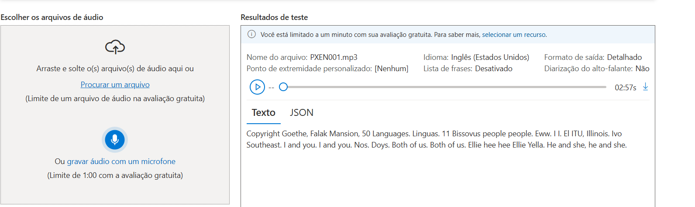
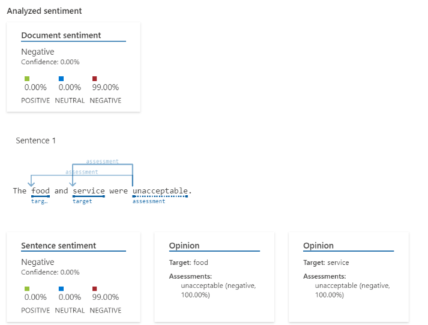

# Analise de sentimento com Language Studio da Azure

## Descrição

A seguir estará detalhado as aplicações usadas no desafio e resumos do material aprendido no módulo de "Analise de Sentimento com Language Studio".

## 1. Language Studio

O **Language Studio** é uma ferramenta que realiza o processamento da linguagem neural, permitindo integrar diversos recursos de linguagem que facilita criar soluções em IA.

### Suas funcionalidades principais:

- **Análise de sentimento**: avalia as emoções, destacando em porcentagem os pontos positivos, negativos ou neutros através do texto ou comentário enviado.
- **Identificação do idioma**: reconhece um idioma predominante do texto.
- **Extração de palavras-chave e entidades**: Identifica termos e entidades predominantes.

---

## 2. Serviço de Bot do Azure

O **Serviço de Bot do Azure** permite criar assistentes virtuais capazes de integrar uma linguagem neural, através de palavras chaves, consultando a sua base de conhecimento para melhores respostas.

### Principais características:

- É uma Plataforma baseada em nuvem.
- Integra outros serviços cognitivos no AI do Azure.

---

## 3. Compreensão da Linguagem Coloquial

Nela é possível trazer falas regionais á IA, fazendo ela entender o uso da linguagem coloquial.

### Elementos fundamentais:

- **Entidades**: elementos que fazem parte da comunicação, como lâmpadas e outros dispositivos.
- **Intenções**: a ação do usuário como ligar a luz e apagá-la.

---

## 4. Reconhecimento e Síntese de Fala

O **Serviço de Fala do Azure** permite converter fala em texto, podendo ser usado em call centers para transcrever ligações de clientes em tele-atendimento, ou em outros tipos de serviços cotidianos.

### Para isso é necessário seguir estes passos:

1. Criar um recurso de conversão de fala para texto no Azure.
2. Selecionar um idioma desejado.
3. Enviar um áudio em inglês, por exemplo.
4. Ao final ter uma transcrição do texto através do áudio.

### 📷 **Imagem de transcrição de áudio em fala**

**Como foi realizado:**

- Acessei o Azure Speech Studio.
- Selecionei a opção "Conversão de fala em texto".
- fiz a importação do áudio no studio.

---

## 5. Análise de Sentimento com Language Studio

Após gerar a transcrição, foi testado a análise de sentimentos atráves de texto, podendo ser usado para avaliações de clientes em hotéis, ou em outros serviços.

### 📷 **Imagem da análise de sentimento:**

**Como usar:**

- Acesse o Language Studio.
- Selecione a opção "Análise de Sentimento".
- Cole o texto desejado.
- Observe os resultados e as porcentagens de emoções (positivo, neutro e negativo).

---

## Responsabilidade no Uso da IA

Embora as ferramentas de IA ofereça benefícios é de extrema importância usar ela com responsabilidade, garantindo a privacidade e a segurança dos dados, mantendo a transparência e a privacidade, evitando percas e vazamento de informações.

---

**Nome:** Daniel Silva

**Curso:** Python Developer (DIO)

**Data:** 25/05/2025
